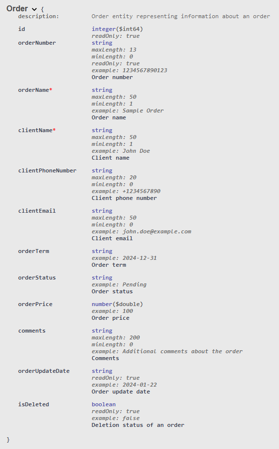
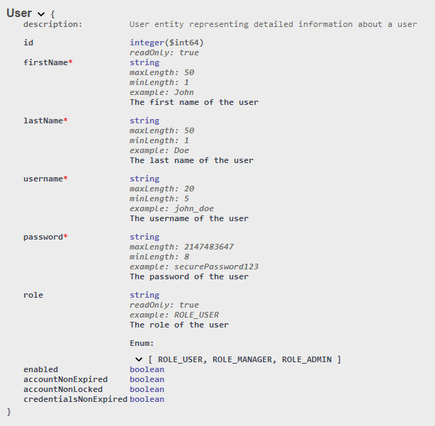
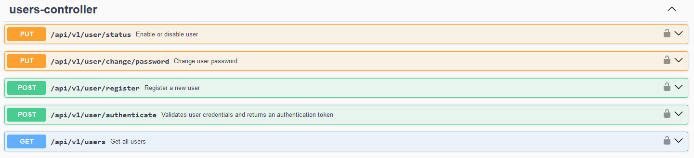
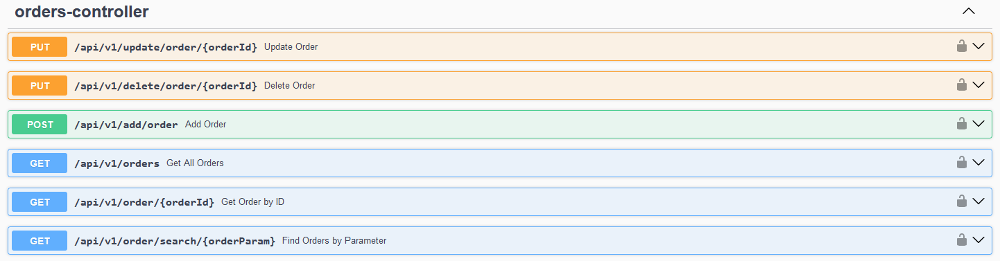

# Order Management Application REST API

This is `Java` `Spring Boot` back-end REST API for `Order Management Application`.

Link to `Android` front-end code: [Front-end](https://github.com/vytautasmatukynas/Order-Management-App-Java-Android)

 

`Order Management Application` is designed to streamline and manage the process of handling orders.
It provides features for creating, updating, and tracking orders for efficient order fulfillment.

 

API uses `SQL` database and has 3 tables - `orders` `order_items` `users`.

`orders` table stores fundamental information about orders - order number, order name, client name, client phone number,
client email, order term, order status, order price, comments, order update date, is deleted.

`order` schema:

`order_items` table contains more detailed information about each item within order - item name, item code, 
item revision, item count, item price, total price, order update date, is deleted.

`order_item` schema:

`users` table stores information about all users - first name, last name, username, password, role, is enabled.

`user` schema:

 

API configurations:

• `OpenAPI configuration` (Swagger) that enables JWT auth for `GET` `POST` `DELETE` and `UPDATE` requests.
Except for `/api/v1/user/authenticate` endpoint.

• `CORS configuration` (@CrossOrigin annotation) that enables access for `GET` `POST` `DELETE` and `UPDATE` requests. 
Except for `/api/v1/users`, `/api/v1/user/delete` and `/api/v1/user/register ` endpoints. 

• `Spring Security configuration` + `JWT` for security and users handling.

• `Spring Security` uses hierarchical architecture for managing `ROLES`. There are 3 `ROLES`:
1. `ROLE_ADMIN` can do every action there is for all `GET` `POST` `DELETE` and `UPDATE` requests. 
2. `ROLE_MANAGER` has same privileges for `GET` `POST` `DELETE` and `UPDATE` requests, just can't `delete` old user and 
`register` new user. 
3. `ROLE_USER` has privileges for `GET` requests, basically `Read-Only` for `orders` and `order_items`, except it has 2 
`POST` requests for `change password` and `authenticate`.

 

### `Unit` test for services, mocks `GET` requests:

 

## More details about API functionality:

### Security configuration handling endpoints for `swagger`:

|    Endpoint     |    Role     |
|:---------------:|:-----------:|
| /v3/api-docs/** | permitAll() |
| /swagger-ui/**  | permitAll() |

 

`SWAGGER UI` endpoint: `/swagger-ui/index.html`.

 

### Security configuration handling endpoints for `users`:

|           Endpoint           |         Role         |
|:----------------------------:|:--------------------:|
|  /api/v1/user/authenticate   |     permitAll()      |
| /api/v1/user/change/password | ADMIN, MANAGER, USER |
|        /api/v1/users         |        ADMIN         |
|    /api/v1/user/register     |        ADMIN         |
|     /api/v1/user/delete      |        ADMIN         |
|     /api/v1/user/status      |        ADMIN         |

 

### Endpoints for `users`:

`AUTHENTICATE` user endpoint: `/api/v1/user/authenticate`.

 

`CHANGE PASSWORD` endpoint: `/api/v1/user/change/password`.

 

`GET ALL` users endpoint: `/api/v1/users`.

 

`REGISTER` user endpoint: `/api/v1/user/register`.

 

`DELETE` user endpoint: `/api/v1/user/delete`.

 

`ENABLE` `DISABLE` user endpoint: `/api/v1/user/status`.

 

### Security configuration handling endpoints for `orders`:

|             Endpoint              |         Role         |
|:---------------------------------:|:--------------------:|
|          /api/v1/orders           | ADMIN, MANAGER, USER |
|      /api/v1/order/{orderId}      | ADMIN, MANAGER, USER |
| /api/v1/order/search/{orderParam} | ADMIN, MANAGER, USER |
|         /api/v1/add/order         |    ADMIN, MANAGER    |
|  /api/v1/update/order/{orderId}   |    ADMIN, MANAGER    |
|  /api/v1/delete/order/{orderId}   |    ADMIN, MANAGER    |

 

### Endpoints for `orders`:

• `GET ALL` orders and order items endpoint: `/api/v1/orders`.

 

• `GET` specific order and order items endpoint: `/api/v1/order/{orderId}`.

 

• `SEARCH` orders by `order_code` `order_name` `client` `client_phone_number` `client_email` endpoint: `/api/v1/order/search/{orderParam}`.

• `SEARCH` is case-insensitive and you don't need to provide full name of search parameter.

 

• `CREATE` new order endpoint: `/api/v1/add/order`.

• `order_number` and `order_update_date` are generated automatically. `order_price` is calculated automatically, summing up prices of all `order_items`.

• New order is created with an empty `order_items` list.

 

• `UPDATE` order endpoint: `/api/v1/update/order/{orderId}`.

• `order_number` remains unchanged, and `order_update_date` is generated automatically.

 

• `DELETE` order endpoint: `/api/v1/delete/order/{orderId}`.

 

### Security configuration handling endpoints for `order_items`:

|             Endpoint              |         Role         |
|:---------------------------------:|:--------------------:|
|   /api/v1/order/{orderId}/items   | ADMIN, MANAGER, USER |
|    api/v1/order/item/{itemId}     | ADMIN, MANAGER, USER |
| /order/{orderId}/items/{itemName} | ADMIN, MANAGER, USER |
|     /order/{orderId}/add/item     |    ADMIN, MANAGER    |
|    /order/update/item/{itemId}    |    ADMIN, MANAGER    |
|    /order/delete/item/{itemId}    |    ADMIN, MANAGER    |

 

### Endpoints for `order_items`:

• `GET` specific `order` all `order_items` endpoint: `/api/v1/order/{orderId}/items`.

 

• `GET` `order_item` endpoint: `api/v1/order/item/{itemId}`.

 

• `SEARCH` order items by `item_name` endpoint: `/order/{orderId}/items/{itemName}`.

• `SEARCH` is case-insensitive and you don't need to provide full name of search item.

 

• `CREATE` new `order_item` to specific `order` endpoint: `/order/{orderId}/add/item`.

• `total_price` is automatically calculated by multiplying `item_count` and `item_price`.

• After creating new `order_item` - `order_price` in `orders` table will be automatically updated.

 

• `UPDATE` `order_item` endpoint: `/order/update/item/{itemId}`.

• `total_price` is automatically calculated by multiplying `item_count` and `item_price`.

• After updating `order_item` - `order_price` in `orders` table will be automatically updated.

 

• `DELETE` `order_item` endpoint: `/order/delete/item/{itemId}`.

• After deleting `order_item` - `order_price` in `orders` table will be automatically updated.
