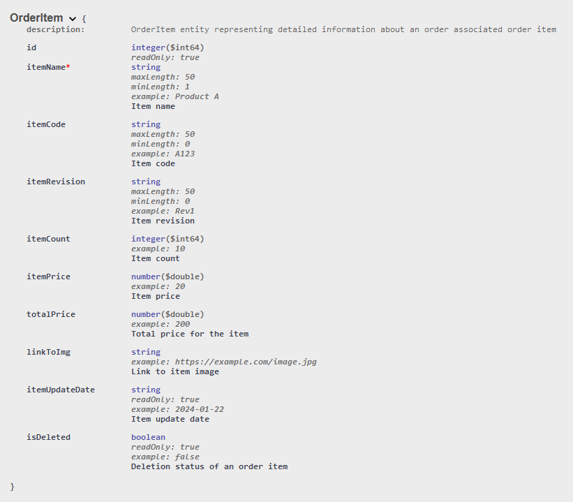

# Order Management API

This is simple `Java` `Spring` backend API for `Order Managment Application`.

 

Frontend with `JavaScript` `React.js`: [LINK TO FRONTEND](https://github.com/vytautasmatukynas/Order-Management-App-JavaScript-React/tree/master)

 

API uses `MySQL` database and has 3 tables - `orders` `order_items` `users`.

`orders` table stores fundamental information about orders. 

`order_items` table contains more detailed information about each item within order. 

`users` table stores information about all users - first name, last name, username, password, role.

 

API configurations:

• Basic `CORS configuration` that enables access for `GET` `POST` `DELETE` and `UPDATE` requests across all endpoints.

• `Spring Security` + `JWT` for security and users handling. `Spring Security` uses hierarchical architecture for 
managing `ROLES`. Security is based on `ROLES`. `ROLE_ADMIN` can do every action there is for all `GET` `POST` `DELETE` 
and `UPDATE` requests. `ROLE_MANAGER` has same privileges for `GET` `POST` `DELETE` and `UPDATE` requests, just can't 
`delete` old user and `register` new user. `ROLE_USER` has privileges for `GET` requests, basically `Read-Only` for
`orders` and `order_items`, except it has 2 `POST` requests for `change password` and `register`.

 

### `JUnit` test for services (`GET` for now...), mocks 10000 requests:

 

## More details about API functionality:

### Security configuration handling endpoints for different `role` for `users`:

|           Endpoint           |         Role         |
|:----------------------------:|:--------------------:|
|    /api/v1/user/register     |        ADMIN         |
|  /api/v1/user/authenticate   | ADMIN, MANAGER, USER |
| /api/v1/user/change/password | ADMIN, MANAGER, USER |
|     /api/v1/user/delete      |        ADMIN         |

 

### Endpoints for `users`:

`REGISTER` user endpoint: `/api/v1/user/register`.

 

`AUTHENTICATE` user endpoint: `/api/v1/user/authenticate`.

 

`CHANGE PASSWORD` endpoint: `/api/v1/user/change/password`.

 

`DELETE` user endpoint: `/api/v1/user/delete`.

 

### Security configuration handling endpoints for different `role` for `orders`:

|               Endpoint                |         Role         |
|:-------------------------------------:|:--------------------:|
|            /api/v1/orders             | ADMIN, MANAGER, USER |
|        /api/v1/order/{orderId}        | ADMIN, MANAGER, USER |
|   /api/v1/order/search/{orderParam}   | ADMIN, MANAGER, USER |
|           /api/v1/add/order           |    ADMIN, MANAGER    |
|    /api/v1/update/order/{orderId}     |    ADMIN, MANAGER    |
|    /api/v1/delete/order/{orderId}     |    ADMIN, MANAGER    |

 

### Endpoints for `orders`:

• `GET ALL` orders and order items endpoint: `/api/v1/orders`.

 

• `GET` specific order and order items endpoint: `/api/v1/order/{orderId}`.

 

• `Search` orders by `order_code` `order_name` `client` `client_phone_number` `client_email` endpoint: `/api/v1/order/search/{orderParam}`.

• `Search` is case-insensitive and you don't need to provide full name of search parameter.

 

• `CREATE` new order endpoint: `/api/v1/add/order`.

• `order_number` and `order_update_date` are generated automatically. `order_price` is calculated automatically, summing up prices of all `order_items`.

• New order is created with an empty `order_items` list.

 

• `UPDATE` order endpoint: `/api/v1/update/order/{orderId}`.

• `order_number` remains unchanged, and `order_update_date` is generated automatically.

 

• `DELETE` order endpoint: `/api/v1/delete/order/{orderId}`.

 

### Security configuration handling endpoints for different `role` for `order_items`:

|                     Endpoint                      |         Role         |
|:-------------------------------------------------:|:--------------------:|
|           /api/v1/order/{orderId}/items           | ADMIN, MANAGER, USER |
|            api/v1/order/item/{itemId}             | ADMIN, MANAGER, USER |
|         /order/{orderId}/items/{itemName}         | ADMIN, MANAGER, USER |
|             /order/{orderId}/add/item             |    ADMIN, MANAGER    |
|            /order/update/item/{itemId}            |    ADMIN, MANAGER    |
|            /order/delete/item/{itemId}            |    ADMIN, MANAGER    |

 

### Endpoints for `order_items`:

• `GET` specific `order` all `order_items` endpoint: `/api/v1/order/{orderId}/items`.

 

• `GET` `order_item` endpoint: `api/v1/order/item/{itemId}`.

 

• `Search` order items by `item_name` endpoint: `/order/{orderId}/items/{itemName}`.

• `Search` is case-insensitive and you don't need to provide full name of search item.

 

• `CREATE` new `order_item` to specific `order` endpoint: `/order/{orderId}/add/item`.

• `total_price` is automatically calculated by multiplying `item_count` and `item_price`.

• After creating new `order_item` `order_price` in `orders` table will be automatically updated.

 

• `UPDATE` `order_item` endpoint: `/order/update/item/{itemId}`.

• `total_price` is automatically calculated by multiplying `item_count` and `item_price`.

• After updating `order_item` `order_price` in `orders` table will be automatically updated.

 

• `DELETE` `order_item` endpoint: `/order/delete/item/{itemId}`.

• After deleting `order_item` `order_price` in `orders` table will be automatically updated.